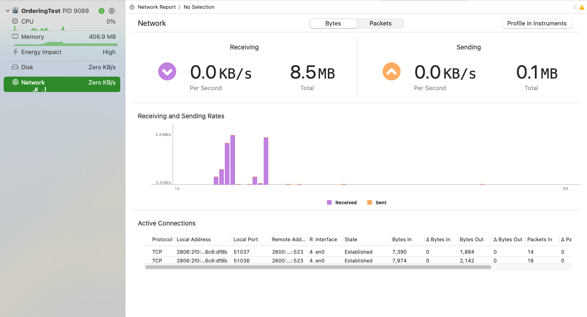

# OrderingTest

## Description 
iOS Challenge for Ordering 

## Setup
This project was built using Xcode 15.3
All layers of our project were modularised using Swift Package Manager
UI was created using SwiftUI, but could be easily modified for any other iOS UI, just edit `OrderingDesignSystem`, `BusinessUIView` and `BusinessFactory`
Minimum iOS supported is iOS 16, which supports almost [96.2%](https://telemetrydeck.com/blog/ios-market-share-13-23/) of all market share

## Architecture
- I decide to use clean architecture to modularise our project, this kind of architectures isn't recommended in small projects because require more files, more complexity and more time to deploy a new component, but as advantage you get a best control of each component, get the facility to reuse your code easily, get the opunity to replace code like change your database administrator from CoreData to Realm or SwiftData easily.
- Each feature has been implemented using the MVVM architecture. This is the common and suggested architecture in SwiftUI.

## Use cases and validations
Some important validations need to be included in every project, some of them are:
- Friendly animated loader included while each backend request is in progress
- Image cache was added to avoid consume so many request to download images, avoid over use of internet data and improve app performance
- Limitation in cache were included to avoid consume full memory in our iPhone
- Friendly error control added in any problem the app could have as internet connection or parsing data fail
- Friendly empty state when we have no information to show
- Pull to refresh added to reload business information

## Dependencies
Almost all the frameworks are created by myself, but next publish dependencies were included:
- [CachedAsyncImage](https://github.com/lorenzofiamingo/swiftui-cached-async-image)

## APP Icon
The logo for this app was created using [Copilot Designer Microsoft](https://copilot.microsoft.com/images/create) with the next prompt:  `app icon design for a local business store app that assists users in discovering new places to buy food, pictorial mark logo`

## Limitations and next improves
- Include unit and ui test
- Request user location, this step wasn't included because I see the endpoint response doesn't suffer any change if I edit this param
- Include analytics like firebase
- iPad Support